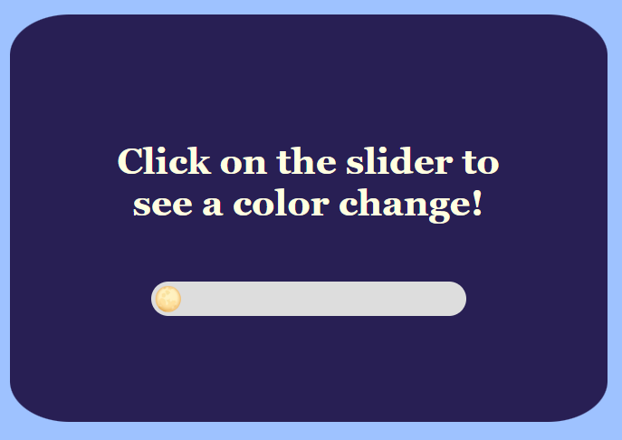
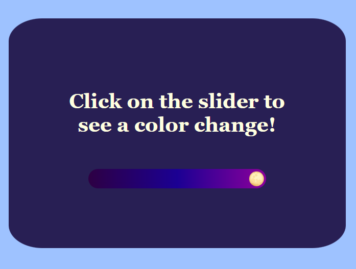

# Project Basic Slider
<em>by Kalecia McNeal</em>

## 🎯 Objective
Create a simple slider that changes color the user moves it across the screen

## 📝 Goal
The main goal of this project is to showcase how versatile a simple slider can be in many ways  

## 🛠️ Tools & Tech
- HTML  
- CSS  
- JavaScript  
- Visual Studio Code 
- Chrome Web Browser  

## 📌 Outcome
With the project all finished, here are the final results: 
- A light overall background with a dark container 
- The heading's color is the color of the moon which is a pale yellow
- A slider with the thumb as the image of the moon 
- Lastly but not least, the background of the slider changes into a nighttime gradient as the user drags it across the screen 

The screenshots for the project can be located here: 

Before:
 

After 

## 🔍 Reflection
Overall, I enjoyed this project! I will admit some parts of the project were not easy. For example, changing the image of the thumb to the moon icon was a little difficult. Another issue was matching the linear-gradient in the function to the style I made in CSS. Once I was able to figure how those parts work by testing them I was able to complete the project!

## 🙏 Acknowledgements
I’ve learned and built these projects using resources like:
- [MDN Web Docs](https://developer.mozilla.org/)
- [W3Docs](https://www.w3docs.com/)
- [HTML Academy](https://htmlacademy.org/)

## 📬 Contact
Here is my contact info for more questions:
- **GitHub:** [Kalecia24824](https://github.com/Kalecia24824)
- **LinkedIn:** [Kalecia McNeal](https://linkedin.com/in/kalecia-mcneal)
- **Email:** [kaleciamcneal@gmail.com](mailto:kaleciamcneal@gmail.com)