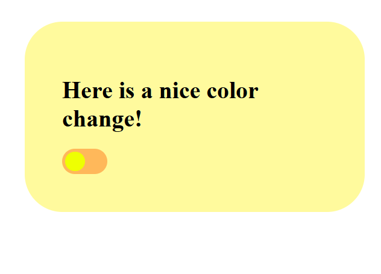
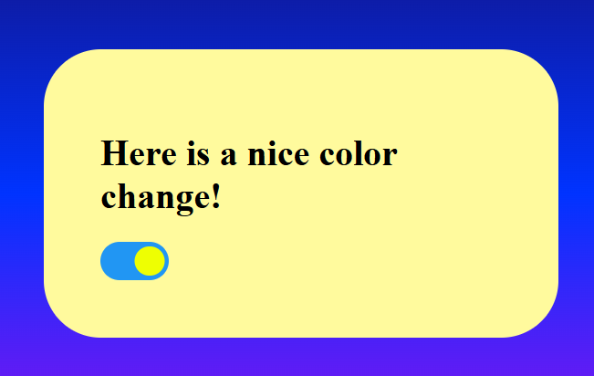

# Project Nighttime Toggle

## 🎯 Objective
The main object of this project is to create a toggle when the screen will turn into night once the user toggles the button 

## 📝 Goal
The main goal of this project is for the developer to understand how a website can change its theme through a toggle

## 🛠️ Tools & Tech
- Form and Semantic HTML5 Elements 
- Gradient CSS3 Styling
- Basic JS ES6+ Functions and Selectors
- Visual Studio Code 
- Chrome Web Browser 

## 📌 Outcome
Here are some of the main features of the project: 
- A simple white background with a light yellow card in the middle

- A toggle with a bright yellow button in contrast with an orange background

- When the toggle is pressed, the background of the screen changes into a night theme along with a blue slider 

The screenshots for the project can be located here: 

Before:
 

After: 

## 🔍 Reflection
I had fun doing this simple toggle exercise. The HTML and CSS were easier around this time since I learned a lot from my last project. The only difficulty was getting the background to fill the entire screen which was an easy fix

## 🙏 Acknowledgements
I’ve learned and built these projects using resources like:
- [MDN Web Docs](https://developer.mozilla.org/)
- [W3Docs](https://www.w3docs.com/)
- [HTML Academy](https://htmlacademy.org/)

## 📬 Contact
Here is my contact info for more questions:
- **GitHub:** [Kalecia24824](https://github.com/Kalecia24824)
- **LinkedIn:** [Kalecia McNeal](https://linkedin.com/in/kalecia-mcneal)
- **Email:** [kaleciamcneal@gmail.com](mailto:kaleciamcneal@gmail.com)