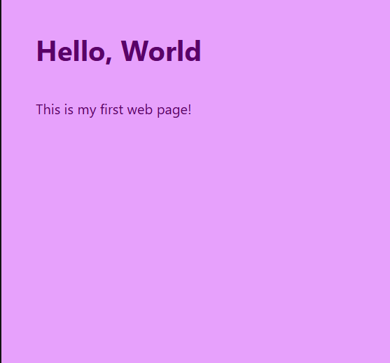

# 🌎 Hello World Project README

## 📃 Summary:
Welcome to the Hello World README where you can find out about everything from the goal to the process itself. 

## 🎯 Objective: 
Create a basic HTML page with a short message and simple styling.

## 🛠 Goal
Learn how to:
- Write basic HTML tags
- Add headings and paragraphs
- Apply simple CSS styling

## 📚 Tools & Resources
- HTML5
- CSS3
- Visual Studio Code 
- Chrome Browser 

## 📝 The Process
1. Created an HTML file with a `<!DOCTYPE html>` declaration.
2. Added a heading and a paragraph.
3. Styled the text with CSS to change the font and color.

**Beginning**: I began this project by creating a HTML boiler plate template for future projects. Then I added the message along with the greeting. 

**Middle**: Next, I colored the background light purple with dark text as contrast. Also I used a modern font as well. 

**End**: Afterwards, I use the Visual Studio preview window to check if the project to see if I did it correctly.

## 📷 Final Screenshot 
Here is the final screenshot for a preview of the project: 

## ❤️ What I would changed:
Overall, I enjoyed this project! There is nothing I would change for now. 

## 🙏 Acknowledgements: 
Here are the following acknowledgements I would give to for assistance with this project: 
[MDN Web Docs](https://developer.mozilla.org/en-US/docs/Learn/Getting_started_with_the_web/HTML_basics)

## 📬 Contact
Here is my contact info for more questions:
- **GitHub:** [Kalecia24824](https://github.com/Kalecia24824/Front-End-Portfolio)
- **LinkedIn:** [Kalecia McNeal](https://linkedin.com/in/kalecia-mcneal)
- **Email:** [kaleciamcneal@gmail.com](mailto:kaleciamcneal@gmail.com)